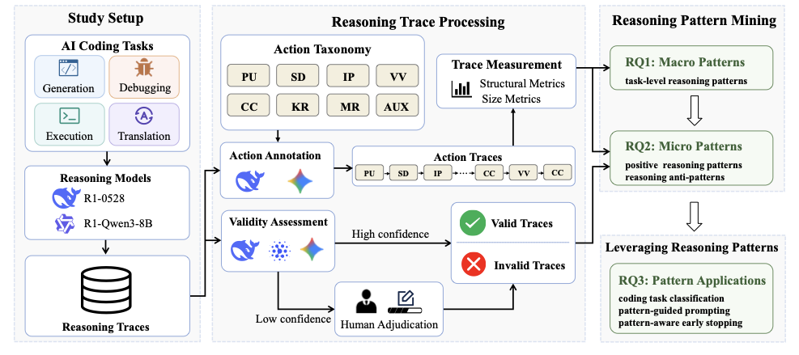

<div align="center">

# Reasoning Patterns for Efficient AI Coding: An Empirical Study

Experiments, datasets, and scripts accompanying our ICSE 2027 paper.

</div>

## Overview

This repository provides the code and resources for analyzing reasoning patterns in AI coding. We collect reasoning traces from Large Reasoning Models (LRMs), transform free-form traces into reasoning action sequences, mine macro and micro reasoning patterns, and study how these patterns can be used for task identification, pattern-guided prompting, and pattern-aware early stopping.

We study four representative coding tasks: code generation, code execution reasoning, program debugging, and code translation. The repository is organized by research questions (RQ1-RQ3) with runnable scripts, benchmark adapters, intermediate results, and paper-ready visualization utilities.

<p align="center">
  
</p>

## Repository Structure

```text
ICSE_2027/
├── rq1_macro_patterns/                         # RQ1: macro reasoning-pattern analysis
│   ├── generation_cot.py                       # Collect CoT traces for code generation
│   ├── execution_cot.py                        # Collect CoT traces for execution reasoning
│   ├── debug_cot.py                            # Collect CoT traces for program debugging
│   ├── translation_cot.py                      # Collect CoT traces for code translation
│   ├── segment_cot.py                          # Segment reasoning traces into action traces
│   └── analysis/                               # Topology, Markov, and discriminative-pattern analysis
│
├── rq2_micro_patterns/                         # RQ2: valid/invalid micro-pattern mining
│   ├── judge_cot.py                            # LLM-as-a-judge trace-validity assessment
│   ├── aggregate_judge_results.py              # Confidence-weighted vote aggregation
│   ├── analyze_cot_vs_test.py                  # Compare trace validity with task correctness
│   └── mine_segmented_cot_patterns.py          # Mine positive patterns and anti-patterns
│
├── rq3_applications/                           # RQ3: applications of discovered patterns
│   ├── rq3_1_task_classification/              # Task identification from action-trace features
│   ├── rq3_2_pattern_guided_prompting/         # Pattern-guided prompting experiments
│   └── rq3_3_pattern_aware_early_stopping/     # Pattern-aware online/offline early stopping
│
├── data/                                       # Benchmarks, adapters, and derived artifacts
│   ├── LCB/                                    # LiveCodeBench v4-v6 data for code generation
│   ├── CodeSense/                              # Input-output prediction data for execution reasoning
│   ├── DebugBench/                             # Debugging benchmark data and evaluation helpers
│   ├── ClassEval_T/                            # Cross-language translation benchmark and evaluator
│   └── derived_cot/                            # Generated traces, segmented traces, and RQ outputs
│
├── utils/                                      # Shared API, runtime config, and JSONL helpers
├── visualization/                              # Paper-ready figures and tables
├── assets/                                     # README assets
└── README.md
```

Generated traces and intermediate experiment outputs are kept under `data/derived_cot/`. Source code should remain under `rq1_macro_patterns/`, `rq2_micro_patterns/`, `rq3_applications/`, `utils/`, `data/*` adapters, and `visualization/`.

## Research Questions

### RQ1: Macro Patterns

RQ1 studies what task-level reasoning patterns emerge across different coding tasks. The pipeline first collects reasoning traces for four tasks, then annotates each trace using the eight-action taxonomy (`PU`, `SD`, `IP`, `CC`, `VV`, `KR`, `MR`, `AUX`), and finally analyzes action traces through transition topology, Markov metrics, and discriminative action-fragment signatures.

Main entry points:

```bash
python3 rq1_macro_patterns/generation_cot.py
python3 rq1_macro_patterns/execution_cot.py
python3 rq1_macro_patterns/debug_cot.py
python3 rq1_macro_patterns/translation_cot.py
python3 rq1_macro_patterns/segment_cot.py
python3 rq1_macro_patterns/analysis/run_analysis.py --model qwen
```

Primary outputs are stored in `data/derived_cot/rq1_traces/`, `data/derived_cot/rq1_segmented/`, and `data/derived_cot/rq1_analysis/`.

### RQ2: Micro Patterns

RQ2 studies what fine-grained reasoning patterns distinguish valid and invalid reasoning trajectories. It uses an ensemble LLM-as-a-judge protocol to label trace validity, aggregates judge outputs with confidence-weighted voting, aligns validity labels with task-level correctness, and mines positive patterns and anti-patterns from segmented action traces.

Main entry points:

```bash
python3 rq2_micro_patterns/judge_cot.py --task generation --cot_model r1
python3 rq2_micro_patterns/aggregate_judge_results.py --cot_model r1
python3 rq2_micro_patterns/analyze_cot_vs_test.py --cot_model r1
python3 rq2_micro_patterns/mine_segmented_cot_patterns.py --cot-model r1 --include-judge-patterns
```

Primary outputs are stored in `data/derived_cot/rq2_judging/`, `data/derived_cot/rq2_eval/`, and `data/derived_cot/rq2_patterns/`.

### RQ3: Applications

RQ3 studies how discovered reasoning patterns can be leveraged to improve AI coding behavior.

- **RQ3.1 Task Identification** trains classifiers on action-trace features to identify the underlying coding task.
- **RQ3.2 Pattern-Guided Prompting** injects positive and negative reasoning-pattern guidance into task prompts.
- **RQ3.3 Pattern-Aware Early Stopping** monitors streaming reasoning traces and triggers answer finalization when anti-patterns indicate low-value continuation.

Main entry points:

```bash
python3 rq3_applications/rq3_1_task_classification/run_classifier.py
python3 rq3_applications/rq3_2_pattern_guided_prompting/generation_cot.py --prompt_method pattern_guided
python3 rq3_applications/rq3_3_pattern_aware_early_stopping/replay.py --task execution --model qwen
python3 rq3_applications/rq3_3_pattern_aware_early_stopping/stream_runner.py --task generation --dry_run
```

Primary outputs are stored in `data/derived_cot/rq3_task_classification/`, `data/derived_cot/rq3_prompting/`, and `data/derived_cot/rq3_early_stopping/`.

## Datasets

- `data/LCB/`: LiveCodeBench v4-v6 instances for code generation.
- `data/CodeSense/`: input-output prediction records for code execution reasoning.
- `data/DebugBench/`: buggy Python samples for program debugging.
- `data/ClassEval_T/`: ClassEval-T programs, tests, signature conversion, and translation evaluation utilities.

## Environment

The project is Python-based. Core scripts use standard Python modules plus `openai`; analysis and visualization scripts use `numpy`, `scipy`, `scikit-learn`, `matplotlib`, and `seaborn`. Some evaluation utilities additionally require `requests`, optional `tiktoken`, and a local `g++` compiler for C++ translation checks.

Model runtime is configured through environment variables or a local `.env` file:

```bash
DEFAULT_MODEL_ALIAS=qwen
QWEN_BASE_URL=...
QWEN_API_KEY=...
QWEN_MODEL=...
```

The shared runtime loader resolves `BASE_URL`, `API_KEY`, and `MODEL` from either alias-specific variables such as `QWEN_API_KEY` or generic variables such as `API_KEY`.

## Tips and Notes

- Keep API keys, session tokens, and local paths out of version control. Use `.env` for local runtime configuration.
- Large per-task text outputs, generated code, and raw JSONL traces can be regenerated and are ignored by default.
- The paper workspace `_ICSE_2027__COT_Analysis/` is local-only; README assets that should render on GitHub are copied to `assets/`.
- If a top-level README becomes too long after adding full reproduction commands, split detailed commands into RQ-specific README files under the corresponding `rq*` directories.
