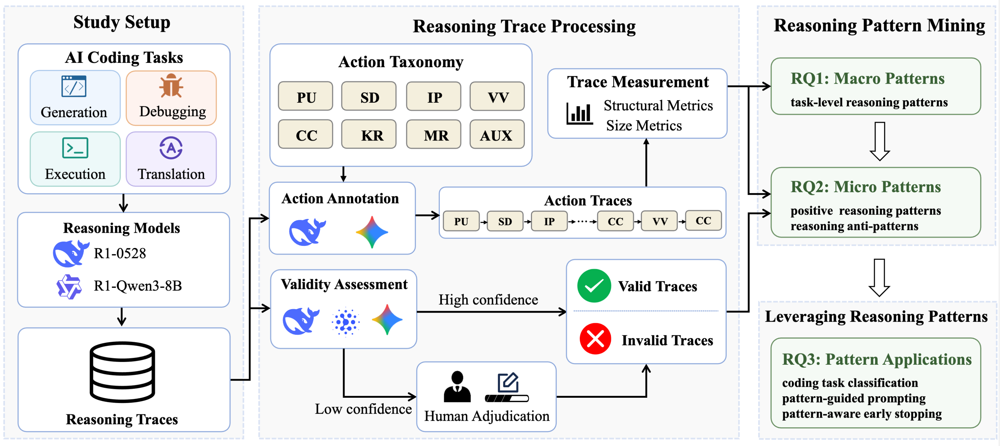

<div align="center">

# Reasoning Patterns for Efficient AI Coding: An Empirical Study

Experiments, datasets, and scripts accompanying our paper.

</div>

## Overview

This repository provides the code and resources for analyzing reasoning patterns in AI coding. We collect reasoning traces from Large Reasoning Models (LRMs), transform free-form traces into structured reasoning action sequences, mine macro and micro reasoning patterns, and apply them to task identification, pattern-guided prompting, and pattern-aware early stopping.

We study two LRMs (DeepSeek-R1-0528 and DeepSeek-R1-0528-Qwen3-8B) across four coding tasks: code generation, code execution reasoning, program debugging, and code translation. The repo is organized by research questions (RQ1–RQ3) with runnable scripts and example datasets/results.

<p align="center">
  
</p>

## Repository Structure

```text
├── rq1_macro_patterns/                         # RQ1: macro reasoning-pattern analysis
│   ├── generation_cot.py                       # Collect reasoning traces for code generation
│   ├── execution_cot.py                        # Collect reasoning traces for code execution reasoning
│   ├── debug_cot.py                            # Collect reasoning traces for program debugging
│   ├── translation_cot.py                      # Collect reasoning traces for code translation
│   ├── segment_cot.py                          # Segment reasoning traces into action sequences
│   ├── segmentation_prompt.txt                 # Action taxonomy prompt for segmentation
│   └── analysis/                               # Topology, Markov, and discriminative-pattern analysis
│
├── rq2_micro_patterns/                         # RQ2: valid/invalid micro-pattern mining
│   ├── judge_cot.py                            # LLM-as-a-judge trace-validity assessment
│   ├── judge_prompt.txt                        # Judge prompt template
│   ├── aggregate_judge_results.py              # Confidence-weighted vote aggregation
│   ├── analyze_cot_vs_test.py                  # Compare trace validity with task correctness
│   └── mine_segmented_cot_patterns.py          # Mine positive patterns and anti-patterns
│
├── rq3_applications/                           # RQ3: applications of discovered patterns
│   ├── rq3_1_task_classification/              # Task identification from action-sequence features
│   ├── rq3_2_pattern_guided_prompting/         # Pattern-guided prompting experiments
│   └── rq3_3_pattern_aware_early_stopping/     # Pattern-aware online/offline early stopping
│
├── data/                                       # Benchmarks and derived artifacts
│   ├── LCB/                                    # LiveCodeBench v4-v6 (code generation)
│   ├── CodeSense/                              # CodeSense (code execution reasoning)
│   ├── DebugBench/                             # DebugBench (program debugging)
│   ├── ClassEval_T/                            # ClassEval-T (code translation)
│   └── derived_cot/                            # Generated traces, segmented results, and RQ outputs
│
├── utils/                                      # Shared API, runtime config, and JSONL helpers
├── visualization/                              # Paper-ready figures and tables
├── framework.png                               # Overview figure
└── README.md
```

## Experimental Results

### RQ1: Macro Patterns

We study what task-level reasoning patterns emerge across different coding tasks. The pipeline collects reasoning traces, annotates each trace using the eight-action taxonomy (`PU`, `SD`, `IP`, `CC`, `VV`, `KR`, `MR`, `AUX`), and analyzes action traces through transition topology, Markov metrics, and discriminative action-fragment signatures.

```bash
python3 rq1_macro_patterns/generation_cot.py
python3 rq1_macro_patterns/segment_cot.py
python3 rq1_macro_patterns/analysis/run_analysis.py
```

Primary outputs stored in `data/derived_cot/rq1_traces/`, `data/derived_cot/rq1_segmented/`, and `data/derived_cot/rq1_analysis/`.

### RQ2: Micro Patterns

We study what fine-grained reasoning patterns distinguish valid and invalid reasoning trajectories. An ensemble LLM-as-a-judge protocol labels trace validity; confidence-weighted voting aggregates judge outputs; validity labels are aligned with task-level correctness; positive patterns and anti-patterns are mined from segmented action traces.

```bash
python3 rq2_micro_patterns/judge_cot.py --task generation
python3 rq2_micro_patterns/aggregate_judge_results.py
python3 rq2_micro_patterns/analyze_cot_vs_test.py
python3 rq2_micro_patterns/mine_segmented_cot_patterns.py --include-judge-patterns
```

Primary outputs stored in `data/derived_cot/rq2_judging/`, `data/derived_cot/rq2_eval/`, and `data/derived_cot/rq2_patterns/`.

### RQ3: Applications

We demonstrate practical applications of discovered reasoning patterns:

- **RQ3.1 Task Identification**: Trains classifiers on action-trace features to identify the underlying coding task.
- **RQ3.2 Pattern-Guided Prompting**: Injects positive/negative reasoning-pattern guidance into task prompts.
- **RQ3.3 Pattern-Aware Early Stopping**: Monitors streaming reasoning traces and triggers answer finalization upon anti-pattern detection.

```bash
python3 rq3_applications/rq3_1_task_classification/run_classifier.py
python3 rq3_applications/rq3_2_pattern_guided_prompting/generation_cot.py --prompt_method pattern_guided
python3 rq3_applications/rq3_3_pattern_aware_early_stopping/stream_runner.py --task generation --dry_run
```

Primary outputs stored in `data/derived_cot/rq3_task_classification/`, `data/derived_cot/rq3_prompting/`, and `data/derived_cot/rq3_early_stopping/`.

## Datasets

- `data/LCB/`: LiveCodeBench v4-v6 instances for code generation.
- `data/CodeSense/`: Input-output prediction records for code execution reasoning.
- `data/DebugBench/`: Buggy Python samples for program debugging.
- `data/ClassEval_T/`: ClassEval-T programs, tests, and translation evaluation utilities.

Large data files are managed via Git LFS. After cloning, run `git lfs pull` to retrieve full data.

## Tips and Notes

- **API access**: Model runtime is configured through environment variables or a local `.env` file (see `utils/runtime_config.py`). Keep API keys out of version control.
- **Reproducibility**: Large per-task text outputs and raw JSONL traces can be regenerated from the scripts above. Pre-computed intermediate results are included under `data/derived_cot/`.
